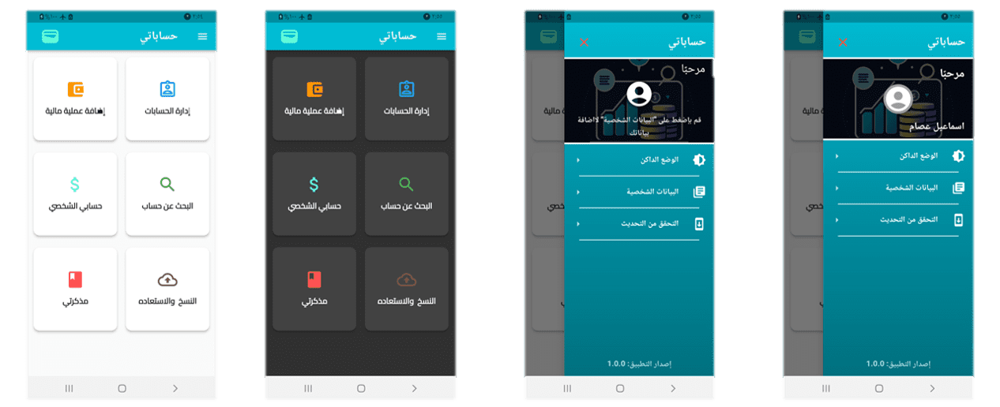
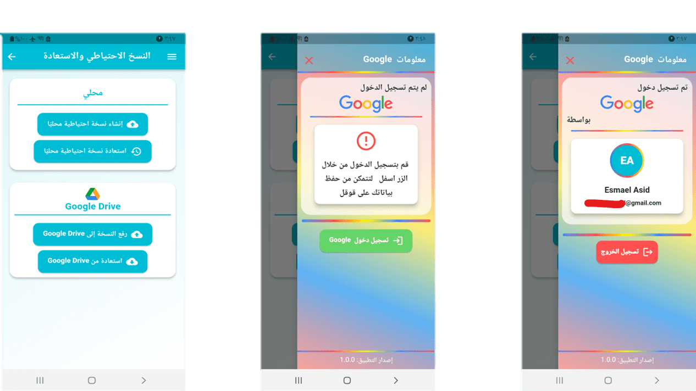

# حساباتي

هو تطبيق احترافي لإدارة الحسابات المالية للمشاريع الاستثماريه الصغيرة والمتوسطة عبر الهاتف

<!-- ## Getting Started

This project is a starting point for a Flutter application.

A few resources to get you started if this is your first Flutter project:

- [Lab: Write your first Flutter app](https://docs.flutter.dev/get-started/codelab)
- [Cookbook: Useful Flutter samples](https://docs.flutter.dev/cookbook)

For help getting started with Flutter development, view the
[online documentation](https://docs.flutter.dev/), which offers tutorials,
samples, guidance on mobile development, and a full API reference. -->

### عرض الصفحة الرئيسية 

### عرض صفحة النسخ الاحتياطي    

<!--  -->

<!-- 
 -->